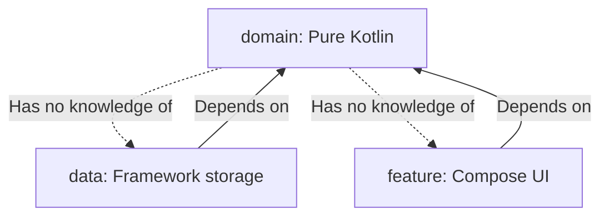

# Contributing Guidelines

This document outlines the coding standards, repository practices, architecture rules, and testing requirements for contributors on **Safe75**.

---

## 1. Clean Architecture Boundaries

To preserve database and platform independence, all contributors must adhere to strict layered boundaries:



- **Rule 1:** Databases and UI code are detail layers. Never import `androidx.room.*` or `androidx.compose.*` in the `domain` package.
- **Rule 2:** Entities (`SubjectEntity`) must not cross into the UI layer. Convert them to domain models (`Subject`) or UI models (`SubjectUiModel`) at the boundary.
- **Rule 3:** Inject dependencies using Hilt modules defined under `di/`. Never instantiate singletons manually.
- **Rule 4:** Inject dispatchers via `DispatcherProvider` instead of directly referencing `Dispatchers.IO`.

---

## 2. Coding & Compose Conventions

### 2.1 Kotlin Standards
- Follow [Google's Kotlin Style Guide](https://android.github.io/kotlin-guides/style.html).
- Use **immutable variables** (`val`) by default.
- Declare variables as nullable (`?`) only when necessary.

### 2.2 Compose Guidelines
- **State Hoisting:** Composables should be stateless when possible. Host mutable state in parent views or ViewModels and pass values and events:
  ```kotlin
  @Composable
  fun PrimaryButton(
      text: String,
      onClick: () -> Unit,
      modifier: Modifier = Modifier
  )
  ```
- **Previews:** Every reusable UI component must have a corresponding `@Preview` layout showcasing light, dark, and scaled states.
- **Design Tokens:** Avoid hardcoding dimension or spacing DP values. Use tokens defined in `Dimensions`, `Radius`, and `Elevation`.

---

## 3. Git Branch & Commit Strategy

### 3.1 Branching Model
- **`main`:** Stable production code. Direct commits are blocked.
- **`dev`:** Active integration branch.
- **Features / Bugs:** Created from `dev` and merged back via Pull Requests:
  - `feature/subject-crud`
  - `bugfix/timetable-ocr-crash`

### 3.2 Commit Conventions
We follow [Conventional Commits](https://www.conventionalcommits.org/):
- `feat(subject): add delete confirmation dialog`
- `fix(ocr): fix timing parser regex mismatch`
- `refactor(database): move AppDatabase to data layer`
- `docs(readme): update build setup instructions`

---

## 4. Pull Request Checklist

Before submitting a Pull Request (PR) for review, verify:
- [ ] Code compiles cleanly.
- [ ] New components are documented with KDoc.
- [ ] Local tests pass (`./gradlew test`).
- [ ] Unused imports are cleaned.
- [ ] UI layouts have been verified in both light and dark modes.
