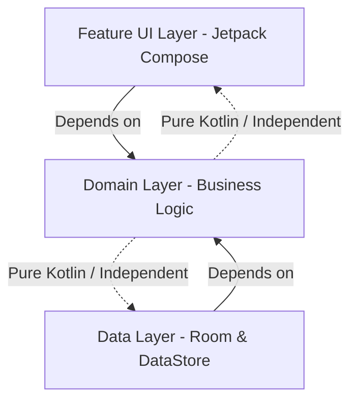
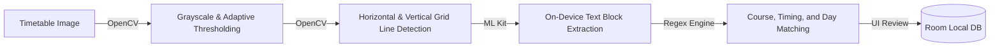

<p align="center">
  
</p>

# Safe75 (v1.0.0)

Safe75 is a robust, offline-first Android application designed to help university and college students track, simulate, and plan class attendance to stay compliant with institutional attendance regulations (such as the standard 75% threshold). By combining predictive simulators, daily logs, smart reminder triggers, and local OCR timetable scanning, Safe75 makes managing your schedule simple and stress-free.

---

## 🚀 Key Features

*   **Timetable OCR Import:** Instantly scan physical schedule sheets or digital screenshots to automatically populate your weekly schedule.
*   **Predictive Simulator:** Calculate the mathematical outcome of attending or missing future classes. Always know your theoretical attendance ahead of time.
*   **Leave Planner:** Model custom leave periods and pre-emptively test their impact on your attendance thresholds before requesting time off.
*   **Home-Screen Widget:** A Material 3 Glance widget showing your overall percentages, today's schedule progress, next class details, and quick logging actions.
*   **Automated Productivity Workers:** Background services schedule daily morning summary alerts, end-of-day unmarked logs nudges, and post-class logging actions.
*   **Semester Lifecycle & Archiving:** Start fresh for new semesters while keeping historical attendance sheets, analytics, and subjects archived safely.
*   **Offline-First & Privacy-Focused:** Safe75 operates with **zero internet permissions**. All OCR scanning, data storage, and backup files remain local on your device.

---

## 🛠️ Tech Stack

*   **Language:** Kotlin (100%)
*   **UI:** Jetpack Compose, Material 3, Material You
*   **Home Screen Widget:** Jetpack Glance
*   **DI:** Dagger Hilt
*   **Database:** Room DB
*   **Preferences:** Preferences DataStore
*   **Async Processing:** Kotlin Coroutines & Flow
*   **Background Tasks:** WorkManager
*   **Computer Vision & OCR:** OpenCV (table cell parsing) + Google ML Kit Text Recognition (on-device)
*   **Build System:** Gradle Kotlin DSL (with Version Catalog)

---

## 📐 System Architecture

Safe75 is built using **Clean Architecture** combined with **MVVM (Model-View-ViewModel)**. This separates business rules from database mechanisms and UI views.



*   **`domain/`**: Houses entity models (`Subject`, `Attendance`, `Schedule`), validator rules, and business Use Cases.
*   **`data/`**: Bridges repositories and storage nodes. Maps Room entity rows to Domain models.
*   **`feature/`**: Compose views and stateful ViewModels utilizing hoisted M3 design tokens.
*   **`di/`**: Hilt modules configuring standard Singleton scopes.

---

## 📸 Timetable OCR Pipeline Overview

Safe75 contains a hybrid computer vision pipeline to automate schedule configuration:



1.  **Image Preprocessing (OpenCV):** Normalizes contrast, applies adaptive threshold filters, and analyzes grid boundaries to separate table cells.
2.  **On-Device Text Extraction (ML Kit):** Runs local OCR scanning to translate image segments into raw text blocks with spatial coordinates.
3.  **Regular Expression Mapping:** Detects day markers (e.g., *Mon, Tue*), room codes, and timestamps (e.g., *10:00 AM - 11:30 AM*) to reconstruct class slots.
4.  **OCR Review & Correction:** Presents parsed timetable structures on a validation UI so users can verify accuracy and make manual corrections before saving.

---

## ⚙️ Installation & Build Instructions

### Prerequisites
*   **JDK 17** or higher
*   **Android Studio Ladybug** (or newer)
*   **Android SDK 26** (Minimum SDK) to **Target SDK 36**

### Building from Source

1.  **Clone the Repository:**
    ```bash
    git clone https://github.com/username/Safe75.git
    ```
2.  **Compile Debug APK:**
    ```bash
    ./gradlew assembleDebug
    ```
3.  **Run Unit Tests:**
    ```bash
    ./gradlew test
    ```
4.  **Generate Release APK & AAB:**
    ```bash
    ./gradlew assembleRelease bundleRelease
    ```
    *Note: Unsigned release artifacts will be located under `app/build/outputs/apk/release/` and `app/build/outputs/bundle/release/` respectively.*

---

## 🤝 Contributing

Contributions are welcome! Please review the [CONTRIBUTING.md](CONTRIBUTING.md) guide in the root folder for details on our coding standards, git branching model, and PR validation checklist.

---

## 📄 License

This project is licensed under the MIT License - see the [LICENSE](LICENSE) file for details.
