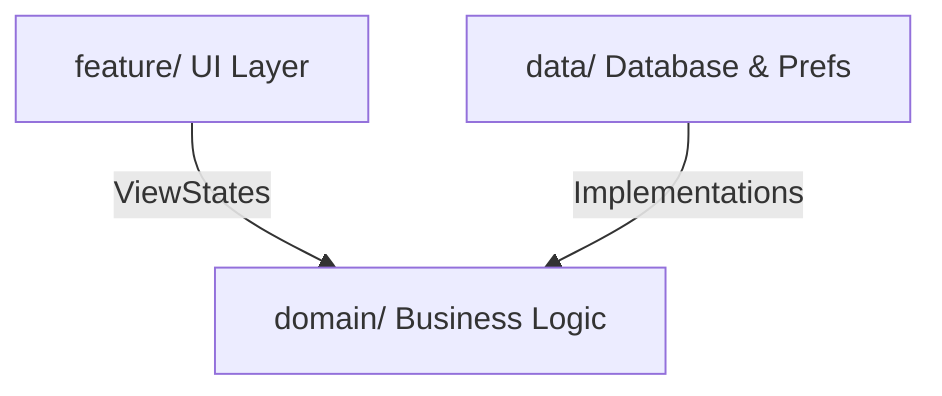

# Attendance Tracker (Safe 75%)

Attendance Tracker is an offline-first Android application designed to help university and college students track, simulate, and plan class attendance to meet institutional compliance thresholds.

---

## Key Features

- **Timetable OCR Import:** Take a photo or screenshot of your weekly timetable to extract subjects, timings, and classrooms locally in seconds.
- **Predictive Simulator:** Run simulations to see how skipping or attending future classes will affect your attendance percentages.
- **Leave Planner:** Check the impact of planned leaves on your attendance targets before scheduling time off.
- **M3 Design & Theming:** Custom color schemes that reflect attendance status (Safe, Warning, Critical) with support for Material You dynamic theming.
- **100% Offline-First:** Operated with zero internet permissions, ensuring complete data ownership and local JSON backups.

---

## System Architecture

The application is structured using **Clean Architecture** and **MVVM** design patterns to promote modularity and testability.



- **`domain/`**: isolated core containing Use Cases, Domain Models, and Validators.
- **`data/`**: Manages data routing. Maps Room entities to Domain Models via specific Mappers.
- **`feature/`**: Jetpack Compose presentation layer, styled using Material 3 design tokens.
- **`di/`**: Hilt dependency injection configuration modules.

---

## Tech Stack

- **Language:** Kotlin
- **UI:** Jetpack Compose, Material 3, Material You
- **DI:** Dagger Hilt
- **Database:** Room
- **Preferences:** Preferences DataStore
- **Async:** Kotlin Coroutines & Flow
- **Background Jobs:** WorkManager
- **OCR:** Google ML Kit Text Recognition
- **Build System:** Gradle Kotlin DSL + Version Catalog

---

## Installation & Build Setup

### Prerequisites
- JDK 17 or JDK 21+
- Android Studio Ladybug (or newer)
- Android SDK 26 (Min SDK) to Target SDK 36

### Build Instructions
1. Clone the repository:
   ```bash
   git clone https://github.com/username/Safe75.git
   ```
2. Build the project using Gradle:
   ```bash
   ./gradlew assembleDebug
   ```
3. Run unit tests:
   ```bash
   ./gradlew test
   ```

---

## Development Roadmap

- **Phase 0:** Planning & Design (Complete)
- **Phase 1:** Core Architecture (Complete)
- **Phase 2:** Subject & Schedule Management (Next)
- **Phase 3:** OCR Scanning & Predictive Simulators
- **Phase 4:** Beta Testing & Production Release

---

## Contributing

We welcome contributions! Please review the [CONTRIBUTING.md](file:///e:/Code&Programs/GitHub/Safe75/docs/CONTRIBUTING.md) guide under the `docs/` folder for information on coding standards, commit styles, and branching workflows.

---

## License

This project is licensed under the MIT License. See the [LICENSE](file:///e:/Code&Programs/GitHub/Safe75/LICENSE) file for details.
