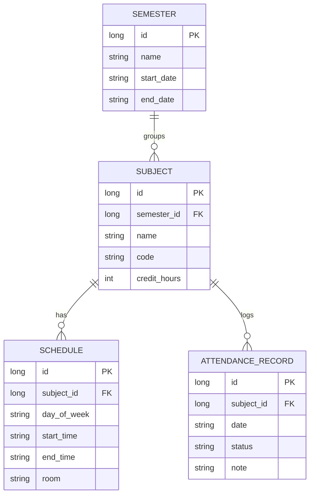

# Database Design Document

This document defines the schema, table attributes, relationships, indexes, cascading rules, and migration strategies for the **Safe75** Room database.

---

## 1. Entity Relationship (ER) Diagram

The Room database is designed around a clean relational structure to handle courses, academic timing blocks, attendance events, and semester configurations.



---

## 2. Table Specifications

### 2.1 Table: `semesters`
Stores academic terms to scope statistics and timetable resets.
- **Primary Key:** `id` (Long, AutoGenerate)
- **Columns:**
  | Column Name | Data Type | Nullable | Description |
  | :--- | :--- | :--- | :--- |
  | `id` | INTEGER | No | Unique identifier. |
  | `name` | TEXT | No | Name of the semester (e.g., "Fall 2026"). |
  | `startDate` | TEXT | No | Start date formatted as ISO `YYYY-MM-DD`. |
  | `endDate` | TEXT | No | End date formatted as ISO `YYYY-MM-DD`. |

### 2.2 Table: `subjects`
Stores course information.
- **Primary Key:** `id` (Long, AutoGenerate)
- **Foreign Key:** `semester_id` references `semesters(id)` on delete **CASCADE**.
- **Columns:**
  | Column Name | Data Type | Nullable | Description |
  | :--- | :--- | :--- | :--- |
  | `id` | INTEGER | No | Unique identifier. |
  | `semester_id` | INTEGER | Yes | Associated semester. Nullable for backlog subjects. |
  | `name` | TEXT | No | Subject title (e.g., "Software Engineering"). |
  | `code` | TEXT | Yes | Optional course code (e.g., "CS-302"). |
  | `creditHours` | INTEGER | No | Number of credit hours (for weighted calculators). |

### 2.3 Table: `schedules`
Stores the weekly timetable slots for subjects.
- **Primary Key:** `id` (Long, AutoGenerate)
- **Foreign Key:** `subject_id` references `subjects(id)` on delete **CASCADE**.
- **Indexes:** Index on `subject_id`.
- **Columns:**
  | Column Name | Data Type | Nullable | Description |
  | :--- | :--- | :--- | :--- |
  | `id` | INTEGER | No | Unique identifier. |
  | `subject_id` | INTEGER | No | Foreign key linking to the parent subject. |
  | `dayOfWeek` | TEXT | No | capitalized weekday string (e.g., "MONDAY"). |
  | `startTime` | TEXT | No | Start time formatted as ISO `HH:mm`. |
  | `endTime` | TEXT | No | End time formatted as ISO `HH:mm`. |
  | `room` | TEXT | Yes | Optional classroom name or lab number. |

### 2.4 Table: `attendance_records`
Logs daily attendance updates.
- **Primary Key:** `id` (Long, AutoGenerate)
- **Foreign Key:** `subject_id` references `subjects(id)` on delete **CASCADE**.
- **Indexes:** Index on `subject_id`, Composite index on `(subject_id, date)`.
- **Columns:**
  | Column Name | Data Type | Nullable | Description |
  | :--- | :--- | :--- | :--- |
  | `id` | INTEGER | No | Unique identifier. |
  | `subject_id` | INTEGER | No | Foreign key linking to the parent subject. |
  | `date` | TEXT | No | Date logged as ISO `YYYY-MM-DD`. |
  | `status` | TEXT | No | Status enum: `PRESENT`, `ABSENT`, `CANCELLED`. |
  | `note` | TEXT | Yes | Short comment (e.g., "Sick leave"). |

---

## 3. Database Constraints & Cascades

- **On Subject Deletion:** When a `subject` record is deleted, all corresponding `schedules` and `attendance_records` reference records are deleted automatically via **CASCADE** rules. This preserves integrity and avoids orphan child rows.
- **On Semester Archive/Deletion:** Deleting a `semester` will cascade delete all child `subjects`, thus wiping their schedules and logs, supporting fresh clean starts.

---

## 4. Database Migration Strategy

### 4.1 Development Strategy
During Phase 2 development, we use Room's `.fallbackToDestructiveMigration()` in `DatabaseModule.kt` to drop and recreate the SQLite schema automatically whenever changes are introduced to entity variables. This speeds up rapid prototyping.

### 4.2 Production Migration Plan
For production updates post-release:
1. **Incremental Migrations:** Write explicit Room `Migration` objects (e.g. `MIGRATION_1_2`) specifying standard SQLite commands:
   ```kotlin
   val MIGRATION_1_2 = object : Migration(1, 2) {
       override fun migrate(db: SupportSQLiteDatabase) {
           db.execSQL("ALTER TABLE subjects ADD COLUMN room TEXT")
       }
   }
   ```
2. **Schema Export:** Set `exportSchema = true` in `AppDatabase` configuration and configure build.gradle to store generated JSON schemas, allowing programmatic schema verification testing.
