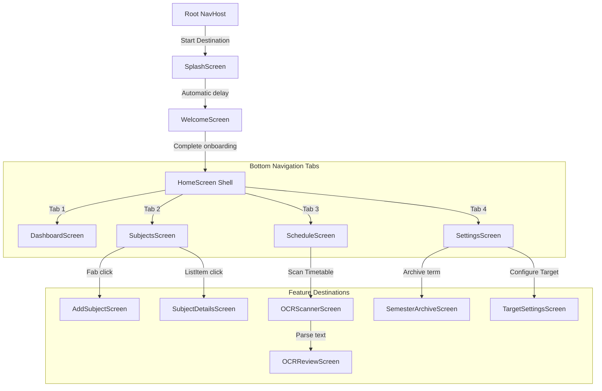

# Navigation Document

This document outlines the screen hierarchy, nested navigation controllers, backstack logic, and transition rules for **Safe75**.

---

## 1. Navigation Screen Hierarchy

The application employs a nested navigation configuration to separate setup flows from the main tab destinations.



---

## 2. Navigation Routes & Nested Graphs

### 2.1 Root Graph (`root_graph`)
The root graph coordinates the launch sequence:
- **Splash Route (`splash`):** Launches dynamic splash layouts. If the user settings indicate onboarding is complete, it skips the welcome route and opens the `main_graph` immediately.
- **Welcome Route (`welcome`):** Standard page sliders introducing core value offerings (timetables, trackers, simulators). Clicking "Get Started" stores onboarding completion preferences and navigates to the `main_graph`.

### 2.2 Main Graph (`main_graph`)
The main graph hosts the bottom bar shell (`HomeScreen`). Clicking tab components navigates using a child controller:
| Destination Tab | Route Name | Screen Content |
| :--- | :--- | :--- |
| **Dashboard** | `dashboard_dest` | Displays predictive rings, leave warnings, and basic stats. |
| **Subjects** | `subjects_dest` | Scrollable list of courses. Features CRUD buttons. |
| **Schedule** | `schedule_dest` | Timetable rendering showing active times and classrooms. |
| **Settings** | `settings_dest` | Configuration items (Theme, Notifications, Archives). |

---

## 3. Back Stack Behavior

To preserve a clean Android navigation experience, back press actions are handled as follows:
1. **Onboarding Exit:** Navigating from Splash/Welcome to `MainGraph` uses `popUpTo(Screen.RootGraph.route) { inclusive = true }`. This clears onboarding flows from the memory back stack, preventing back-button returns to the onboarding screens.
2. **Bottom Navigation Tab Switching:** Navigating between bottom bar tabs uses:
   ```kotlin
   navController.navigate(route) {
       popUpTo(navController.graph.findStartDestination().id) {
           saveState = true
       }
       launchSingleTop = true
       restoreState = true
   }
   ```
   This ensures that pressing the back button on secondary tabs (e.g. Settings) returns the user to the start destination tab (Dashboard) instead of exiting the application immediately.
3. **Double Back Press Exit:** Pressing back on the Dashboard tab exits the application.

---

## 4. Future Deep Links Specifications

For subsequent releases (Phase 3), the app will support system deep links to launch screens directly:
- **Daily Notification Reminder Click:** Navigates directly to the Dashboard screen via URL: `attendance://tracker/dashboard` to log attendance.
- **Schedule Alert Click:** Launches subject calendar via URL: `attendance://tracker/schedule?subjectId={id}`.
