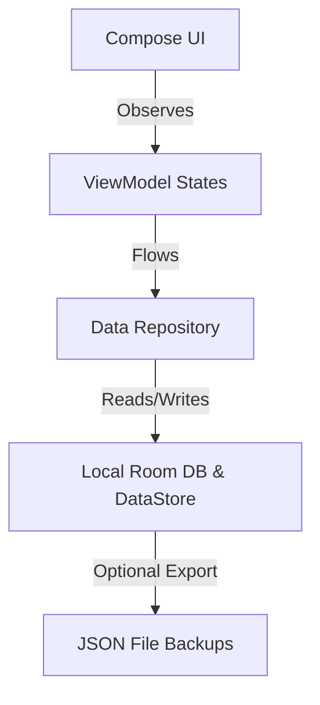

# Project Requirements Document (PRD)

## 1. Project Vision
**Safe75** is a robust, offline-first Android application designed to empower college and university students to manage, plan, and analyze their class attendance. By providing predictive simulators, scheduled class alerts, and automated timetable imports via OCR, the app aims to alleviate the stress of meeting strict institutional attendance criteria (e.g., the standard "Safe 75%" threshold) and allow students to plan academic leaves proactively.

---

## 2. Problem Statement
Many higher education institutions enforce strict attendance criteria (often 75% or 80%), with severe penalties for non-compliance, including course registration debarment. Students struggle to track their attendance manually due to:
- Dispersed timetables across multiple physical sheets, images, or PDFs.
- Lack of foresight on how missing a specific class affects their overall eligibility.
- Inability to calculate how many consecutive classes they can safely skip for medical emergencies or personal events.
- Clunky existing tracker apps that contain intrusive ads, require online sync, or possess poor Material 3/You design integration.

---

## 3. Objectives
- **Automate Setup:** Provide seamless OCR scanning of physical or screenshot timetables to configure the weekly class calendar in seconds.
- **Predictive Planning:** Offer simulator tools allowing students to predict future percentage outcomes based on prospective attendance behaviors.
- **Encourage Consistency:** Deliver discrete, local notification reminders prompting students to log attendance immediately after class blocks.
- **Data Privacy & Longevity:** Guarantee 100% data ownership via an offline-first architecture leveraging Room and local JSON backup mechanisms.

---

## 4. Target Users
The target users of Safe75 are:
| Persona | Profile | Core Pain Point |
| :--- | :--- | :--- |
| **University Students** | Manages a busy 5-6 day timetable. Regularly participates in extracurriculars. | Needs to know if they can safely skip a class for events without dropping below 75%. |
| **Working Students** | Balances part-time work/internships with academic schedules. | Requires highly custom calendars and scheduling alerts to navigate tight timelines. |
| **Academic Planners** | Highly organized, schedules study tasks, logs details. | Prefers offline control, detailed statistics charts, and exportable data backups. |

---

## 5. Core Features (In-Scope)
- **Subject Management:** Create, read, update, and delete (CRUD) subjects with credit hours and targets.
- **Schedule TIMETABLE:** Configure weekly recurring class time blocks per subject.
- **Attendance Logger:** Log status (Present, Absent, Cancelled) on any class event with options for short text notes.
- **Interactive Dashboard:** Summarize overall and subject-level attendance percentages with color-coded Material 3 indicator rings.
- **Timetable OCR Import:** Extract schedule parameters directly from timetable snapshots using Google ML Kit.
- **Attendance Simulator:** Predict final percentages based on "what-if" skipping or attending scenarios.
- **Leave Planner:** Input intended leave dates and receive alerts if skipping those dates violates eligibility thresholds.
- **Backup & Restore:** Export database records as clean JSON files and import them to restore state.
- **Semester Reset & Archive:** Reset statistics for new academic terms while archiving past data.

---

## 6. Future Features (Out-of-Scope for MVP)
- **Cloud Syncing:** Multi-device synchronization via Firebase Auth and Firestore database.
- **Calendar Integration:** Export schedules directly into external Google Calendar or Outlook accounts.
- **Geofenced Logging:** Prompt users to log attendance automatically when GPS detects they are in campus coordinates during class timing.
- **Group Timetable Sharing:** Share timetables with classmates via QR codes.

---

## 7. Functional Requirements

### 7.1 Lifecycle of a Subject
- A user can create a subject by specifying a unique name, optional code, and credit hours.
- Default attendance requirements are loaded from settings, but can be overridden per subject.
- Deleting a subject performs a cascade delete of all corresponding attendance logs and schedules.

### 7.2 Timetable Configurations
- Classes can be scheduled on weekdays (Monday to Sunday).
- Each schedule block requires a start time and end time.
- Timetable conflicts must warn the user but not prevent creation (supporting dual-lab/tutorial sessions).

### 7.3 Logging Rules
- Attendance logs default to the current system date.
- Past logs can be retroactively modified via calendar interfaces.
- "Cancelled" classes must not negatively or positively impact percentage calculations (excluded from total count).

---

## 8. Non-Functional Requirements

### 8.1 Performance Goals
- **Cold Launch Time:** App must transition from splash to loaded interactive state in under 1.5 seconds on mid-range devices.
- **Database Query Latency:** DB reads must complete in less than 50ms, run on IO threads, and present data using asynchronous Kotlin Flows.
- **OCR Execution Speed:** Processing a timetable snapshot must complete in under 5 seconds locally without triggering ANR dialogs.

### 8.2 Security & Privacy Goals
- **Local Storage Encryption:** Sensitive settings and backup preferences must be encrypted via Tink or Android Keystore under EncryptedSharedPreferences (planned transition).
- **Network Permissions:** The application uses network access only for device enrollment and explicit bug-report uploads. Attendance records remain local and are excluded from the upload payload.

### 8.3 Accessibility & Localization
- **M3 Contrast Compliance:** Contrast ratios between texts and background elements must adhere to WCAG 2.1 AA standards (minimum 4.5:1 ratio).
- **Screen Reader Support:** All interactive composables (buttons, cards, text fields) must contain meaningful semantic `contentDescription` text values.
- **Dynamic Font Scaling:** UI layouts must adapt to system font scaling settings between 100% and 150% without clipping labels.

---

## 9. Offline-first Strategy

The application uses local storage as the single source of truth:
1. All queries are resolved immediately from the local SQLite/Room database.
2. In-memory caching/Flow emissions are used to render layouts instantly.
3. Network calls (like future cloud sync adapters) run as non-blocking background sync operations in WorkManager, ensuring offline logging remains unaffected.

---

## 10. Risks & Assumptions
*   **OCR Parsing Accuracy:** Timetables vary heavily in grid formats, leading to potential OCR mismatches.
    *   *Mitigation:* Introduce a mandatory **OCR Review Screen** allowing users to review and manually edit parsed times and courses before confirming db inserts.
*   **Android System Standby:** Background notifications for class alarms might be delayed by OEM battery-saver policies.
    *   *Mitigation:* Leverage WorkManager's `Expedited` workers and request standard `Exact Alarm` permissions for alarm managers.

---

## 11. Success Criteria
- **User Setup Success Rate:** 90% of test users successfully configure their timetables via OCR or manual setup in under 2 minutes.
- **Predictive Accuracy:** Simulators output mathematically precise percentages corresponding with actual class events.
- **Stability:** Zero crash rates in production, monitored via future local crash dumps or telemetry flags.
