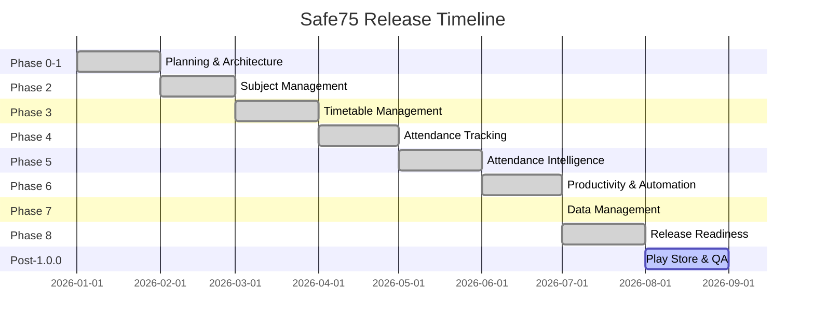

# Project Roadmap

This document outlines the multi-phase timeline and release criteria for **Safe75**.

---

## 1. Development Lifecycle Overview

---

## 2. Phase Details

### Phase 0: Planning & Design
- **Objective:** Finalize specifications, entity schemas, navigation routes, and contributor guidelines.
- **Key Milestones:**
  - Create the documentation suite (PRD, Architecture, DB Design, Branding).
  - Draft UI wireframes and design system variables.
- **Testing:** Validate Mermaid diagram formats and PR templates.
- **Exit Criteria:** All planning files are stored in `docs/` and approved.

### Phase 1: Foundation (Completed)
- **Objective:** Establish the clean architecture codebase, Gradle DSL build configurations, and baseline UI navigation.
- **Key Milestones:**
  - Build the package structure (`core/`, `data/`, `domain/`, `feature/`, `di/`).
  - Configure Room database and settings DataStore integrations.
  - Implement the single Activity host, AndroidX Splash API, and navigation routing.
- **Testing:** Verify code compilation via `./gradlew assembleDebug`.
- **Exit Criteria:** Successful compilation and setup of database/Hilt graphs.

### Phase 2: Subject & Schedule Management (Completed)
- **Objective:** Implement CRUD capabilities for courses and schedule time blocks.
- **Key Milestones:**
  - Build `SubjectScreen` rendering the list of configured courses.
  - Implement `AddSubjectDialog` dialog and validate inputs using `SubjectValidator`.
  - Create schedule CRUD operations mapping timetables to database tables.
- **Testing:** Write unit tests for repositories and validators.
- **Exit Criteria:** CRUD functionality works with full database integration.

### Phase 3: Timetable Management (Completed)
- **Objective:** Weekly timetable with subject slots, rooms, and teachers; search and day tabs.
- **Exit Criteria:** Full weekly schedule CRUD with duplicate/conflict validation.

### Phase 4: Attendance Tracking (Completed)
- **Objective:** Mark Present / Absent / Cancelled per class with per-subject and per-day views.
- **Exit Criteria:** Attendance recording flows and duplicate-date guards.

### Phase 5: Attendance Intelligence (Completed)
- **Objective:** Dashboards with safe/warning/critical percentages, per-subject stats, searchable history.
- **Exit Criteria:** Accurate percentage calculations verified by unit tests.

### Phase 6: Smart Productivity & Automation (Completed)
- **Objective:** OCR timetable/statement import, attendance simulator, leave planner, notification settings, WorkManager reminders.
- **Exit Criteria:** Reminder workers and OCR flows operational.

### Phase 7: Data Management & Semester Lifecycle (Completed)
- **Objective:** JSON backup/restore, semester archive, semester reset wizard, and data-integrity scan.
- **Exit Criteria:** 116 unit tests green; backup pipeline validated end-to-end.

### Phase 8: Production Release Readiness (Completed — v1.0.0)
- **Objective:** Ship a store-ready v1.0.0 release.
- **Key Milestones:**
  - Home-screen widget (Glance) with auto-refresh and deep links.
  - Release build config: R8 + shrink, ProGuard rules, signing, versioning.
  - Debug-only StrictMode/logging; startup optimizations; adaptive layout.
  - `:benchmark` baseline-profile scaffold; `docs/release/` Play Store docs.
- **Exit Criteria:** Debug + release APKs build, 116 unit tests pass, accessibility/error-state audits clean.

### Post-1.0.0: Production Release
- **Objective:** Launch on the Google Play Store.
- **Key Milestones:**
  - Generate the ART baseline profile on a device (`:benchmark:connectedCheck`) and ship it.
  - Close the release with the real signing key; upload AAB; internal → closed → open → production.
  - Monitor crash-free sessions and install size over the first 7 days.
- **Exit Criteria:** Production APK under 15MB, zero crashes over 7 days (see `docs/release/ReleaseChecklist.md`).
