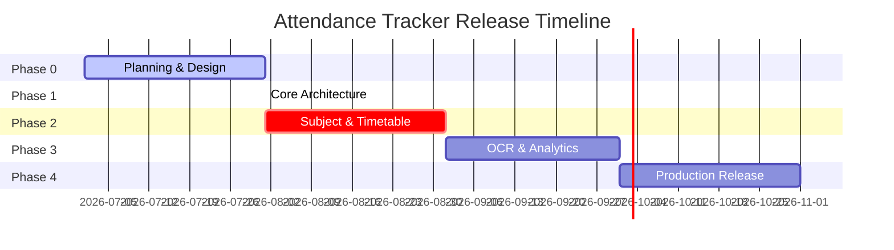

# Project Roadmap

This document outlines the multi-phase timeline and release criteria for **Attendance Tracker**.

---

## 1. Development Lifecycle Overview

---

## 2. Phase Details

### Phase 0: Planning & Design
- **Objective:** Finalize specifications, entity schemas, navigation routes, and contributor guidelines.
- **Key Milestones:**
  - Create the documentation suite (PRD, Architecture, DB Design, Branding).
  - Draft UI wireframes and design system variables.
- **Testing:** Validate Mermaid diagram formats and PR templates.
- **Exit Criteria:** All planning files are stored in `docs/` and approved.

### Phase 1: Foundation (Completed)
- **Objective:** Establish the clean architecture codebase, Gradle DSL build configurations, and baseline UI navigation.
- **Key Milestones:**
  - Build the package structure (`core/`, `data/`, `domain/`, `feature/`, `di/`).
  - Configure Room database and settings DataStore integrations.
  - Implement the single Activity host, AndroidX Splash API, and navigation routing.
- **Testing:** Verify code compilation via `./gradlew assembleDebug`.
- **Exit Criteria:** Successful compilation and setup of database/Hilt graphs.

### Phase 2: Subject & Schedule Management (Next)
- **Objective:** Implement CRUD capabilities for courses and schedule time blocks.
- **Key Milestones:**
  - Build `SubjectScreen` rendering the list of configured courses.
  - Implement `AddSubjectDialog` dialog and validate inputs using `SubjectValidator`.
  - Create schedule CRUD operations mapping timetables to database tables.
- **Testing:** Write unit tests for repositories and validators.
- **Exit Criteria:** CRUD functionality works with full database integration.

### Phase 3: OCR & Predictive Analytics
- **Objective:** Implement ML Kit timetable scanning and predictive dashboards.
- **Key Milestones:**
  - Integrate Google ML Kit OCR text-recognition camera workflows.
  - Implement parsing regex mapping recognized text blocks into timetable schedules.
  - Build `AttendanceSimulator` slider dashboard widgets.
  - Implement JSON Backup/Restore functions.
- **Testing:** Run OCR extraction tests with varying timetable grid shapes.
- **Exit Criteria:** Timetable parsing matches source images with at least 85% accuracy.

### Phase 4: Production Release
- **Objective:** Perform bug fixes, styling adjustments, and launch the app on the Google Play Store.
- **Key Milestones:**
  - Integrate the pluggable `Logger` with Firebase Crashlytics.
  - Build Android Homescreen Widgets for quick status checks.
  - Configure the release build pipeline with ProGuard obfuscation.
- **Testing:** Launch a closed internal testing track with 20 real users.
- **Exit Criteria:** Production APK size is under 15MB with zero crash rates over 7 days.
