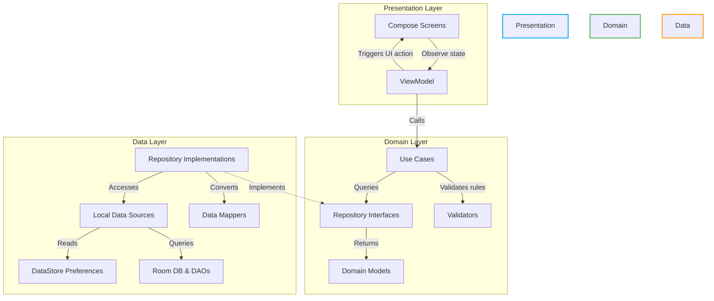
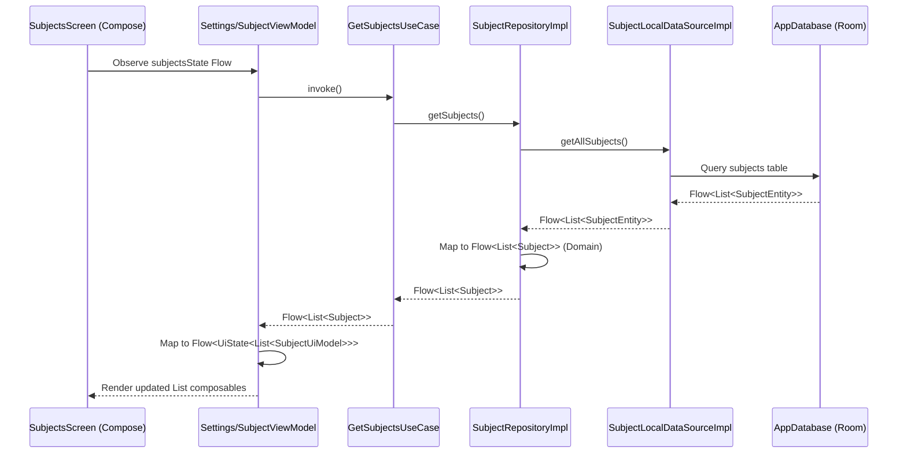
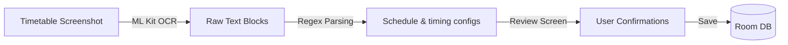

# System Architecture Document

This document details the architectural layout, package boundaries, data flows, and configuration modules of the **Attendance Tracker** Android application.

---

## 1. Clean Architecture & MVVM Structure

Attendance Tracker is constructed using **Clean Architecture** layered concepts, complemented by **MVVM (Model-View-ViewModel)** for the presentation structure.



### 1.1 Layer Responsibilities

#### Presentation Layer (`feature/`)
- **Compose UI Screens:** Purely declarative screens rendering views depending on exposed state. Uses Material 3 components and local themes.
- **ViewModels:** Persist UI state during orientation changes. ViewModels invoke Domain Use Cases and expose state flows (`StateFlow<UiState<T>>`).

#### Domain Layer (`domain/`)
- **Domain Models:** Pure Kotlin data classes representing core objects (e.g. `Subject.kt`, `Schedule.kt`).
- **Use Cases:** Coordinate application business rules. For example, `AddSubjectUseCase` runs validation before calling insertion.
- **Validators:** Evaluate input metrics to verify rules (e.g., verifying that class end-times are later than start-times).
- **Repository Interfaces:** Define contract boundaries for data access.

#### Data Layer (`data/`)
- **Repository Implementations:** Manage data distribution strategies. They convert database schemas to domain models via Mappers.
- **Local Data Sources:** Interfaces wrapping Room DAOs or DataStore structures to isolate SQL queries.
- **Data Mappers:** Transform database entity classes (`SubjectEntity`) to domain objects (`Subject`) and UI models (`SubjectUiModel`), protecting the UI from DB implementation leaks.

---

## 2. Dependency Flow
The dependencies flow inward. The Domain layer is completely isolated, with zero knowledge of SQLite, Room, or Jetpack Compose libraries.

```text
    [feature/UI] -----> [domain] <----- [data/database/network]
```

- High-level details are provided using **Hilt Dependency Injection** modules (`di/`), ensuring constructor parameters are provided automatically.

---

## 3. Data Flow
When retrieving subjects for the Dashboard, the data flow progresses as follows:



---

## 4. Subsystem Architectures

### 4.1 Database Layer (Room)
- Managed by `AppDatabase.kt` (inheriting from `RoomDatabase`).
- Uses KSP code generation to compile DAO query builders.
- Configured with `fallbackToDestructiveMigration()` for easy database development upgrades.

### 4.2 Preference Storage (Preferences DataStore)
- Configured in [SettingsPreferences.kt](file:///e:/Code&Programs/GitHub/Safe75/app/src/main/java/com/attendance/tracker/data/local/preferences/SettingsPreferences.kt).
- Replaces standard SharedPreferences with asynchronous flows, avoiding main-thread lockups.
- Stores simple configurations: `theme_mode`, `notifications_enabled`, and `last_backup_timestamp`.

### 4.3 Background Task System (WorkManager)
- Used for non-blocking periodic database backups and synchronization.
- Tasks are scheduled via `PeriodicWorkRequestBuilder` with constraints (e.g. device charging, idle state).

### 4.4 OCR Timetable Pipeline


---

## 5. Architectural Decisions & Rationale

| Decision | Selection | Rationale |
| :--- | :--- | :--- |
| **Modular Hilt DI** | Separate files in `di/` | Improves readability. Splitting database, repositories, data sources, and dispatchers allows quick replacements during testing. |
| **Offline-first SQLite** | Room Database | SQLite provides relational queries for timetables, logs, and stats calculations. Room provides compile-time query validation. |
| **Data Mappers** | Dedicated `mapper/` files | Prevents database-specific annotations (like `@Entity` or `@ColumnInfo`) from reaching the UI layer. Keeps presentation code clean. |
| **DispatcherProvider** | Custom Coroutines wrapper | Direct injection of `DispatcherProvider` makes tests run on mock test dispatchers without thread timing errors. |
| **Nested Navigation** | Multi NavHost | Isolates splash and onboarding transitions from tabbed screens, ensuring backstacks behave as expected when users tap tab buttons. |
