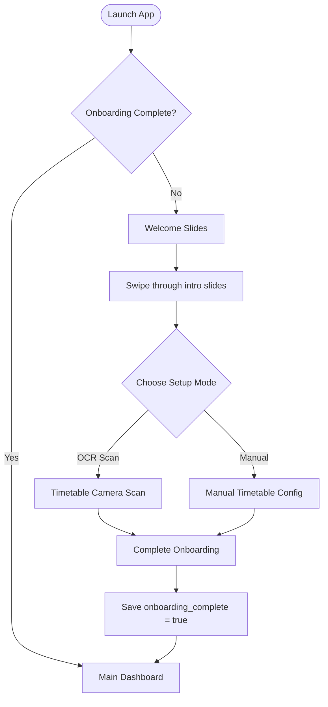
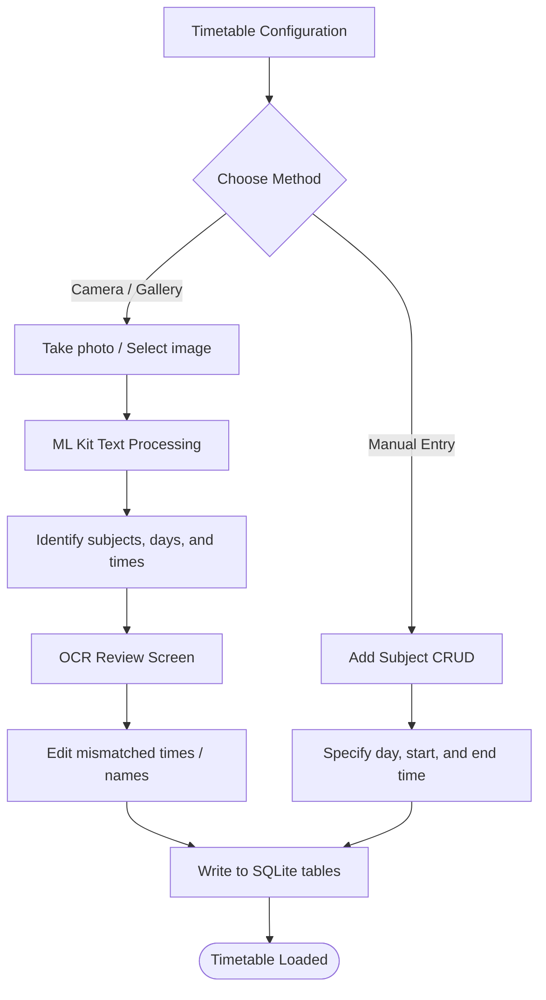
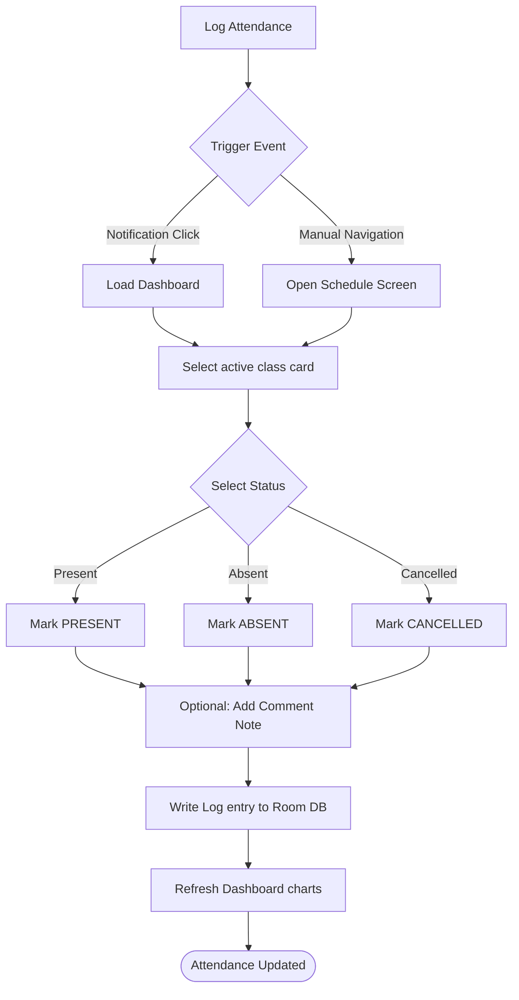
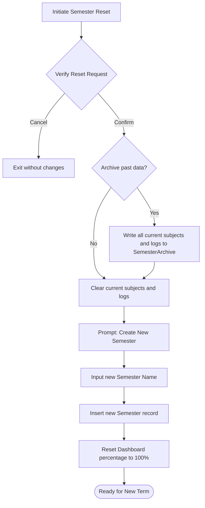
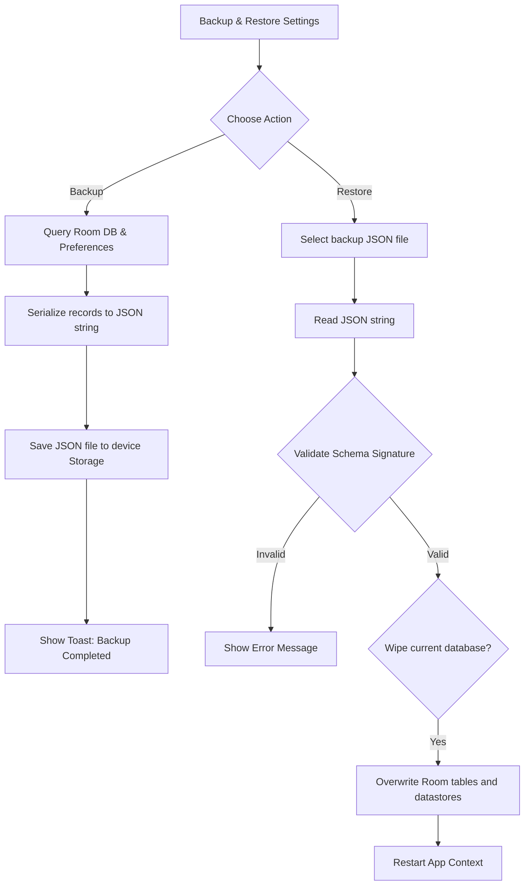

# User Flow Document

This document outlines the user flows for key operations in **Safe75**.

---

## 1. Onboarding & First Launch Flow
This flow describes what a new user experiences when launching the application for the first time.

---

## 2. Timetable Import Flow (OCR & Manual)
How users configure their subjects and weekly class timings.

---

## 3. Daily Attendance Logging Flow
The flow for logging attendance entries daily.

---

## 4. Semester Archive & Reset Flow
The process to archive completed semester stats and prepare for a new academic term.

---

## 5. Local Backup & Restore Flow
Safeguarding database files offline.

